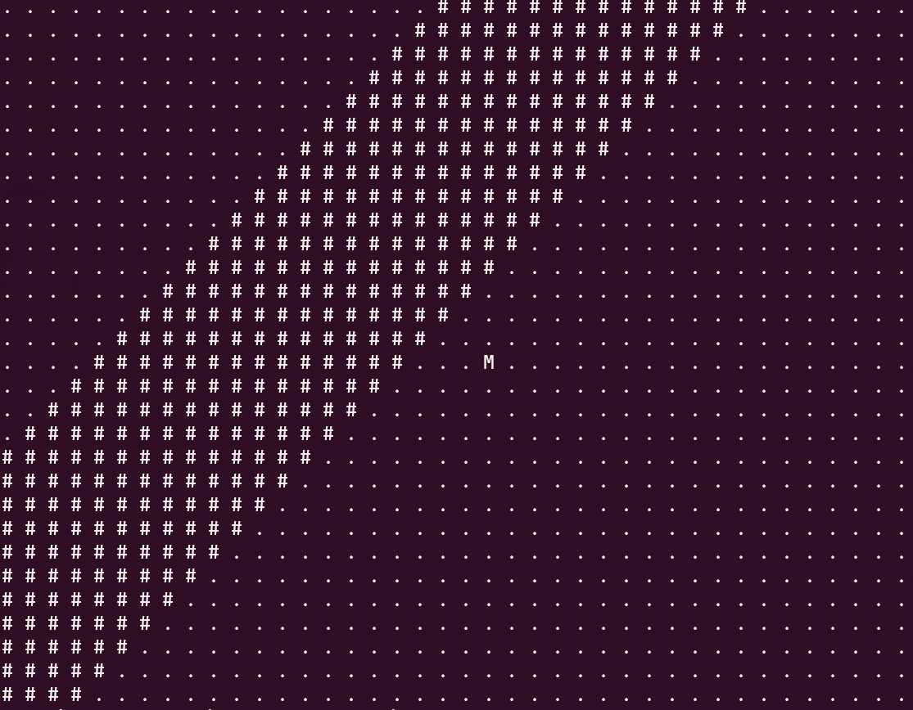

Movement of the drone in the **X** and **Y** axis from the image

----

*Depends:* **nothing!**

To compile run **make** command in the root folder.

Algorithm is located in **algorithm** folder, it's dependencies are there.

**Testing.c** contains a program that generates an image:

The algorithm will move the middle point **M**, so that the line from the above generated image is in the center!

After movement image will be filled with **.**

